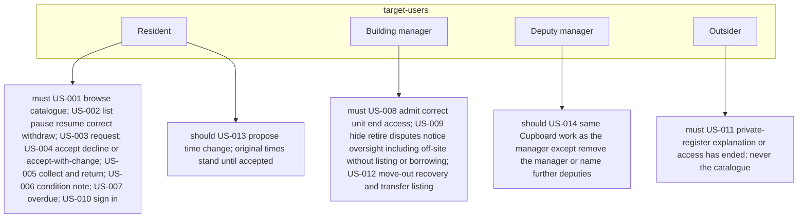
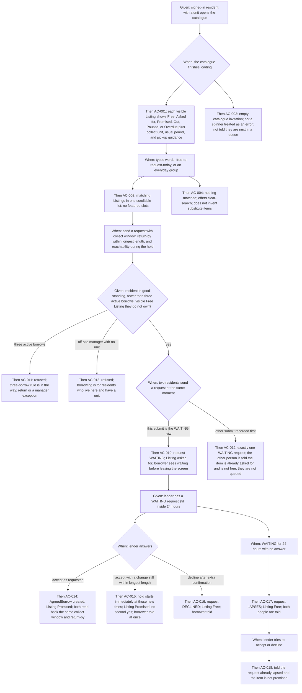
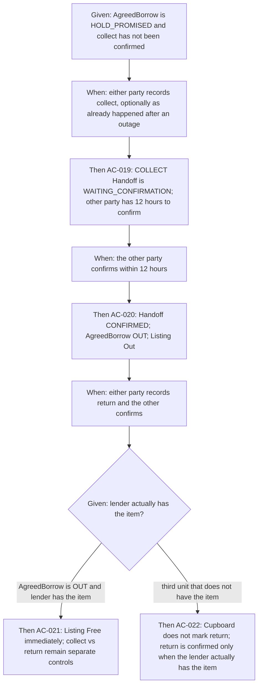
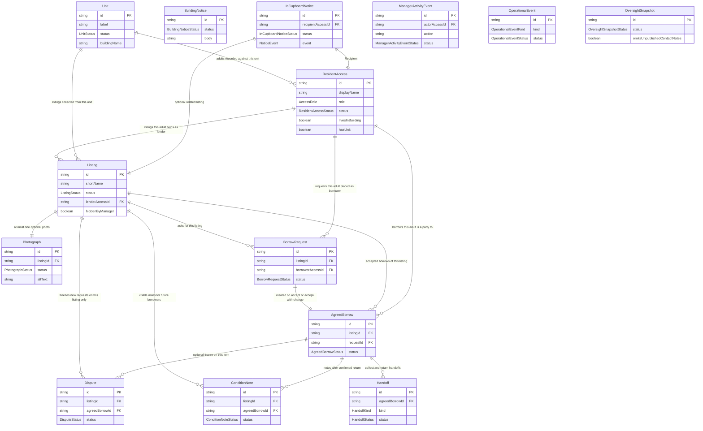
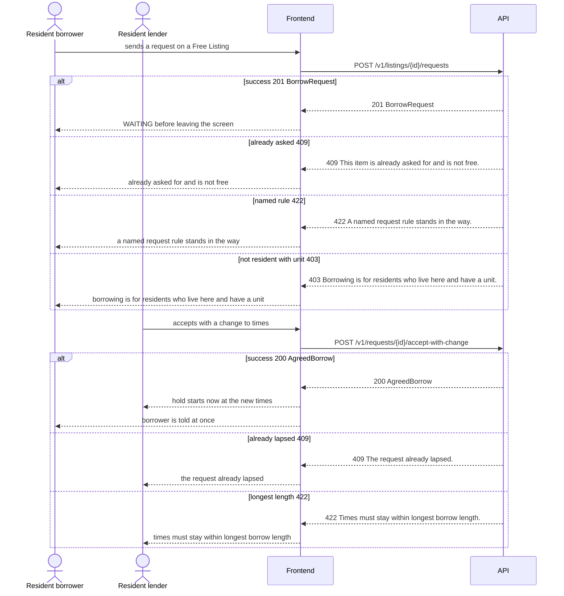

# The Building Cupboard

## Problem Context

Residents of this one occupied apartment building already lend drills, folding chairs, cake tins, steamers, and spare air mattresses, but the arrangement is informal and uneven. People ask in the lobby chat, forget who has what, leave items on landings, and stop lending after a bad experience. Useful things sit unused while a neighbor buys the same object for a single afternoon.

Lenders cannot say yes or no without being chased. Borrowers cannot tell pickup hours, whether the set is complete, or which door to knock. After move-out, a former resident may still be treated as responsible for an item that is out. Damaged or incomplete returns become quiet resentment rather than a dated record about the item. The building manager hears disputes only after they have soured the hallway.

Without a private register, the workaround is the same group chat, plus word of mouth. That fails fairness: a handful of households can dominate popular items with no honest status, and outsiders (guests, drivers, search engines) must not browse names, units, photos, or the catalogue. Solving this now is what lets the committee run a neighborly cupboard — visible, time-bounded, and accountable — without turning neighbors into a shop.

---

## Solution Overview

The Building Cupboard is a shared, building-only register of household items residents will lend, plus a way to ask, agree times, pick up, return, and record how the item came back. Physical items stay in homes; the product records agreements and status words (Free, Asked for, Promised, Out, Paused, Overdue, Retired).

A manager admits each adult in person and gives a private phrase or code. That adult signs in on a phone they already use. Residents with a unit list and borrow as themselves. An off-site manager does manager work only. Neighbors browse an honest catalogue, request with a collect window and return-by, and lenders accept as requested, accept with a change (hold starts now), or decline within 24 hours. Collect and return are mutually confirmed. Overdue is visible and blocks new asks without fees. The manager hides or retires unsafe listings, handles disputes, recovers items after move-out, and prints five oversight answers for the committee.

The Cupboard does not take money, run queues, publish a public website, require SMS, or rate people.

---

## User Flows

### Flow 1: Browse and search the catalogue

**Actor**: Resident
**Precondition**: Signed in with a unit; session display name is visible.

**Happy Path**:
1. The resident opens the catalogue.
2. The product shows a skeleton loader, then Listings with status words, collect unit, usual period, and pickup guidance.
3. The resident filters by words, free-today, or an everyday group.
4. Matching items appear in one scrollable list.
5. They open a row and can answer whether it is free, who to collect from, and when it must come back.

**Error Path — nothing matched**:
1. The resident searches for words that match no Listing.
2. The product detects zero matches.
3. The product presents: "Nothing matched. Clear search to see the catalogue again."
4. The user can clear search; the product does not invent substitutes.

### Flow 2: List an item and pause later

**Actor**: Resident (lender)
**Precondition**: Lives here, has a unit, not an off-site manager without a unit.

**Happy Path**:
1. The lender opens create listing and confirms the item is not forbidden.
2. They fill required fields and optionally attach one photo.
3. The Listing is Free in the catalogue.
4. When nothing is in-flight they pause it; status becomes Paused and no new requests arrive.

**Error Path — pause while a request is waiting**:
1. A neighbor has a WAITING request on this Listing.
2. The lender tries to pause or withdraw.
3. The product presents: "You cannot pause or withdraw yet. A request is waiting — answer, cancel, or wait for it to lapse."
4. The user can accept, decline, or wait; pause stays blocked.

### Flow 3: Request a free item

**Actor**: Resident (borrower)
**Precondition**: In good standing, fewer than three active borrows, item is Free and visible.

**Happy Path**:
1. The borrower opens the Listing and chooses request.
2. They enter collect window, return-by within longest length, and reachability during the hold.
3. While sending, the control cannot be used twice.
4. They see the ask as waiting before leaving the screen.
5. The Listing shows Asked for.

**Error Path — already asked**:
1. Another resident's request is recorded first (including a simultaneous submit).
2. The product records exactly one WAITING request.
3. The product presents: "This item is already asked for and is not free."
4. The user is not queued and can browse other Free items.

### Flow 4: Accept with a change (hold starts now)

**Actor**: Resident (lender)
**Precondition**: WAITING request within 24 hours.

**Happy Path**:
1. The lender opens the incoming request and reads the hoped-for times.
2. They accept with a change still within longest length.
3. The hold starts immediately; Listing is Promised; both can read back the new times.
4. The borrower is told at once and may cancel before collect.

**Error Path — answer after lapse**:
1. Twenty-four hours pass with no answer.
2. The request lapses and the Listing is Free.
3. The product presents: "This request already lapsed."
4. The user can wait for a new request; they cannot promise this lapsed ask.

### Flow 5: Mutual collect and return

**Actor**: Resident (party to the borrow)
**Precondition**: AgreedBorrow is HOLD_PROMISED or OUT.

**Happy Path**:
1. Either party records collect (including already happened after an outage).
2. The other confirms within 12 hours; the item is Out.
3. Before return, either may record a one-line drop-off change the other can see.
4. Return is recorded when the lender actually has the item and the other confirms.
5. The Listing is Free immediately.

**Error Path — third-unit drop**:
1. Someone tries to mark return from a unit that does not have the item.
2. The product refuses to mark return from a third unit.
3. The product presents: "Return is confirmed only when the lender actually has the item."
4. The user can record a drop-off note and talk in person; they cannot fake the handoff.

### Flow 6: Condition note after return

**Actor**: Resident (party to a confirmed return)
**Precondition**: Return is confirmed.

**Happy Path**:
1. The person opens the condition-note form.
2. They write a short paragraph about the item, not the person.
3. The note is dated and signed with display name.
4. Future borrowers see it on the Listing.

**Error Path — edit after send**:
1. The author tries to change a sent note.
2. The product refuses silent edits.
3. The product presents: "This note cannot be edited. Ask the manager if it should be hidden."
4. The manager may hide abusive notes or notes that name a child; that hide is recorded.

### Flow 7: Overdue block

**Actor**: Resident (borrower)
**Precondition**: Return-by has passed and the item is not returned.

**Happy Path**:
1. Status words show Overdue on the borrow and Listing.
2. Evening overdue notices appear in-Cupboard and cannot be turned off.
3. New requests are blocked until return or a manager exception.

**Error Path — seven days still gone**:
1. Seven days pass still overdue.
2. The manager is told and the Listing is paused for new requests.
3. The product keeps the item on the recovery list as unresolved if needed.
4. The user can return the item or speak to the manager; there are no fees.

### Flow 8: Admit and sign in

**Actor**: Building manager, then Resident
**Precondition**: Manager seat exists (out of band for the first manager).

**Happy Path**:
1. The manager records display name, unit, and lives-in-that-unit.
2. In person they give a private phrase or code.
3. The adult signs in on a phone they already use.
4. Display name and unit stay visible while signed in.

**Error Path — failed sign-in**:
1. The adult types a wrong phrase.
2. The product does not reveal whether a name exists.
3. The product presents: "Sign-in did not work. Try again or speak to the manager."
4. The user can retry or recover only by a new phrase issued in person — not SMS.

### Flow 9: Outsider gate

**Actor**: Outsider or removed resident
**Precondition**: No active ResidentAccess, or status ENDED.

**Happy Path**:
1. They open the Cupboard.
2. They see only the private-register explanation, or that access has ended.
3. They never see Listings, photos, units, or names.

**Error Path — ended access with items still out**:
1. A former resident tries to confirm a return in the product.
2. In-product confirm is refused.
3. The product presents: "Your access has ended. Arrange outstanding returns with the manager."
4. The manager records recovery on the recovery list.

### Flow 10: Manager hide during an in-flight ask

**Actor**: Building manager (including off-site)
**Precondition**: Duplicate, nonsense, forbidden, or unsafe Listing; a request may be waiting.

**Happy Path**:
1. The manager hides or retires with why-words.
2. If an ask was in-flight, both people are told and the ask does not hang.
3. Ordinary browsing no longer shows the item; history remains for the manager.

**Error Path — resident tries a manager-only action**:
1. A signed-in resident attempts hide, admit, or export.
2. The product refuses.
3. The product presents: "Ask the manager."
4. The user can message the manager; they do not get a blank page.

### Flow 11: Later time change after an agreement

**Actor**: Resident (party to an agreed borrow)
**Precondition**: AgreedBorrow already exists (distinct from the lender's first accept-with-change).

**Happy Path**:
1. Either party proposes new times within longest length.
2. The other is told; original times stand.
3. If the other accepts, both read back the new times.

**Error Path — other party does not accept**:
1. The proposal sits without a yes.
2. Original collect window and return-by remain the agreement.
3. The product presents the original times as still in force.
4. The user can cancel the hold before collect if that is still allowed, or complete the handoff as first agreed.

### Flow 12: Deputy limits

**Actor**: Deputy manager
**Precondition**: Named by the building manager; always a resident.

**Happy Path**:
1. While the manager is away the deputy admits a resident or hides a nonsense listing.
2. Residents continue to browse, request, accept, collect, and return.

**Error Path — deputy tries to name a further deputy**:
1. The deputy opens manage access and tries to name another deputy or remove the manager.
2. The product refuses.
3. The product presents: "Only the building manager can name deputies or remove the manager."
4. The user can continue other manager tasks.

---

## Design Rationale

These four choices were made in clarification round 1 (qa-log.md). Each is recorded as DEC-001 through DEC-004.

### Manager-issued sign-in (DEC-001)

The question was how an already-admitted adult signs in on a phone they already use when there is no public recover-access page and the product must not assume they can receive a text message. Public OIDC, magic links, and SMS OTP were rejected. After admit, the manager gives a private phrase or code in person. Forgotten sign-in is a new phrase issued the same way. Failed sign-in never reveals whether a name exists.

### Residents only may list or borrow (DEC-002)

Staff who do not live here have no lending privilege, yet a manager account is allowed and nested resident powers would let an off-site manager list and request. The decision is residents only: adults who live here and have a unit. There is no Staff lender role. An off-site manager does admit, hide, retire, disputes, notice, oversight, and recovery only, unless they also live here and have a unit — and they always act as themselves.

### Hold starts on accept-with-change (DEC-003)

If the lender accepts but changes the collect window or return-by, waiting for a second yes would leave the item neither free nor promised. The hold starts immediately at the lender's new times (still within longest length). The borrower is told at once and may cancel before collect. A later proposed time-change after an agreement already exists is different: original times stand until the other party accepts.

### Pause blocked while in-flight (DEC-004)

If a lender could pause or withdraw while a request is waiting or a hold is open, a household could still be promised an item that just left the catalogue. Pause and withdraw stay available when nothing is in-flight. While an ask is in-flight they are blocked until the lender answers, cancels, or the ask or hold lapses, and the product names the step in the way. Manager hide or retire of an unsafe listing is a separate safety path (ASSM-020).

---

## Out of Scope

The following are explicitly excluded from this spec. They may be addressed in future specs.
Each item here also appears in `context.non-goals[]`.

- **More than one building**: One occupied building, one Cupboard.
- **Accounts for people who neither live nor work as staff**: Guests and the public stay outsiders.
- **Money**: No payments, deposits, late fees, insurance, buying, selling, or giving away.
- **Forbidden goods as listings**: Food, medicine, alcohol, weapons, and other forbidden items are refused, not listed.
- **Staff delivery**: The manager is never asked to carry items between floors.
- **Skills and sitting matching**: Not a babysitting or pet-sitting marketplace.
- **Public website**: Search engines and passers-by cannot browse the catalogue.
- **Public OIDC, SMS OTP, or self-serve recovery**: Sign-in is manager-issued in person.
- **Queues, featured slots, league tables, graphs, star ratings**: Fairness is the three-borrow cap and honest status words.
- **Automatic legal enforcement**: The Cupboard records what people agreed; it does not prosecute.
- **Lobby-chat import**: Greenfield; existing fob and written-notice processes stay outside.
- **Required SMS or email notices**: In-Cupboard notices are the source of record.

---

## Boundaries

Guardrails for the build phase — a three-tier contract.
Keep each list short and concrete; these are read by downstream build agents.

**Always do**
- Validate inputs at the API boundary in ordinary language; name the field and the next step.
- Keep catalogue, photos, units, and names behind an admitted-adult session.
- Show status as words; keep collect and return as separate controls.
- Record in-Cupboard notices as the source of record for borrow and access events.

**Ask first**
- Changing session length or adding a fast household switch (Q-001).
- How the first manager seat is created in this building (Q-002).
- Whether manager hide during an in-flight ask may cancel the hold (Q-003).
- Naming an outside notification channel or adding a second live building notice.

**Never do**
- Take payment, add a waitlist, add star ratings of people, or publish a public catalogue.
- Assume SMS, invent public OIDC self-signup, or add a public recover-access page.
- Let an off-site manager list or borrow without a unit.
- Mark return from a third unit that does not have the item.
- Commit secrets or skip the session check to make a screen look done.

---

## Assumptions & Open Questions

### Key Assumptions

The following gaps in the stated requirements were filled with standard defaults or inferred from context. Items marked ⚠️ require human confirmation before build.

- ⚠️ **ASSM-002**: Current display name and unit stay visible while signed in. Stay signed in on this phone until the person signs out or the manager ends access. Switching adult is sign out then sign in as the other person with that adult's own manager-issued phrase or code — no fast switch that could hide who is acting. *Confidence: medium.*
- ⚠️ **ASSM-003**: The first manager seat is granted when the Cupboard is set up for this building (out of band) and that person receives a manager-issued phrase or code in person. A successor is appointed by the resident committee out of band. v1 has no self-serve 'become manager'. An off-site first manager may have no unit and then cannot list or borrow. *Confidence: medium.*
- ⚠️ **ASSM-004**: Before a listing is shown, the lender confirms it is not on the forbidden list. Obvious forbidden words in the name are refused with the reason and the manager is told. Lender marks whether the fixed caution applies (not inferred from 'tools' alone). Remaining junk is the manager's to hide or retire. *Confidence: medium.*
- ⚠️ **ASSM-005**: Unpublished contact notes are visible only to the lender who typed them. Replacement value is visible to the lender, to the manager, and to the two parties if the item is reported gone or in dispute — never as a catalogue price. *Confidence: medium.*
- ⚠️ **ASSM-008**: Before return, either party may record a one-line drop-off change the other can see. Return is confirmed only when the lender actually has the item. A wrong-unit drop stays a human conversation; the Cupboard does not mark return from a third unit. *Confidence: medium.*
- ⚠️ **ASSM-010**: One timezone and one currency are configured once for this building at setup. All civil times use that timezone and show weekday. Replacement value is a plain number in that currency, never a checkout price. Not ISO 8601-only display. *Confidence: medium.*
- ⚠️ **ASSM-011**: Opening the catalogue and seeing free/busy for ~100 items completes in under 1 second at p95 on ordinary building connectivity. Waiting several seconds for that answer fails the AC. Not a 500ms generic SLA. *Confidence: medium.*
- ⚠️ **ASSM-013**: Manager may unhide a listing that was hidden as duplicate/nonsense. A safety retirement stays retired unless the manager explicitly treats a new listing as the replacement. Ended access is reversed by admitting the person again. Confirmation copy is one plain sentence naming the action. *Confidence: medium.*
- ⚠️ **ASSM-014**: v1 delivers §14 events as in-Cupboard notices the person sees when they open the Cupboard, plus the single building-wide catalogue banner. Outside-channel opt-in is omitted until the building names the existing lift-outage channel. Non-urgent outside nudges, if later added, are not sent 21:00–08:00 building time; overdue evening notices aimed at 18:00–20:00. Both parties are told when a dispute opens and when the manager decides. Accept-with-change tells the borrower at once. A later proposed time-change after an agreement already exists tells the other party and waits; original times stand until they accept. SMS/email is not a required channel. *Confidence: medium.*
- ⚠️ **ASSM-015**: Manager types the unit using existing building numbers (no unit-admin screen). Manager may replace or end the single notice. Declined/lapsed/cancelled requests appear on the 12-month manager activity list but do not follow the confirmed-borrow 12+12 summary rule. A dispute decision is a dated remark; the freeze lifts per the chosen outcome; the dispute stays in 12-month activity. Ended access cannot confirm collect/return in the Cupboard; the manager records recovery. *Confidence: medium.*
- ⚠️ **ASSM-020**: Manager hide or retire of a duplicate, nonsense, forbidden, or unsafe listing may cancel a waiting request or an open hold; both people are told. This is manager safety work, not a lender pause. *Confidence: medium.*

- ✓ **ASSM-001**: Exactly one waiting request is recorded. The other person is told the item is already asked for and is not free; they are not queued. The item never has two waiting requests.
- ✓ **ASSM-006**: Unauthorized manager actions are refused in ordinary language with 'ask the manager' as the next step. An off-site manager who tries to list or request is refused in ordinary language: listing and borrowing are for residents who live here and have a unit; manager work is still available. A late accept/decline is told the request already lapsed. Failed export: told to try again; on-screen lists remain the answers. Mid-flow sign-in loss: the unsent action did not go through; they start it again after signing in.
- ✓ **ASSM-007**: At most one optional photo of the actual item, common phone picture types, usable on a phone. Upload failure: listing still saves without a photo; person is told the picture did not attach. Photo leaves ordinary catalogue immediately on withdraw/retire; manager may still see it while that listing record is kept, then it goes with the record. Do not specify a vendor or API.
- ✓ **ASSM-009**: Case-insensitive match on name and description; groups and free-today are filters, not ranks. No featured slots. With on the order of 100 items, show all matches in one scrollable list. Zero matches: nothing matched plus clear-search, no invented substitutes. Not a paginated 20-item list.
- ✓ **ASSM-012**: Only admitted people see catalogue, photos, units, and names. Photos and notes are not reachable as a public website. No extra legal document at every open. Do not invent a crypto stack as a requirement. Not public OIDC/bearer auth.
- ✓ **ASSM-016**: Operational list shows time, failed sign-in without revealing whether a guessed name exists, and forbidden-listing attempts with listing name and unit. Hide/retire/access-end activity names who did it, when, which item or person, and the manager's why-words. 'Burst' is visible clustering on that list, not a pager. Committee judges §3 success from the five oversight answers, not a dashboard. Observability is manager lists, not Datadog.
- ✓ **ASSM-017**: A printable readable page of those five answers that the manager can print or save as a document from the phone or laptop. Not a spreadsheet, not graphs. Catalogue snapshot is current; borrow records in that document cover three months. Do not invent an export API.
- ✓ **ASSM-018**: Map §18.3 and §24 to WCAG 2.2 AA for core resident flows. Manager and deputy core tasks (admit, hide/retire, dispute remark, five questions, export) are also completable by keyboard and screen reader. English copy; weekday + local civil date/time.
- ✓ **ASSM-019**: Time-change before collect, return-by extension after collect, move-out pause/retire/transfer, and manager recovery list are in v1 because they are specified. The twelve-point list is the minimum demonstration, not an exclusion.
- ✓ **ASSM-021**: Greenfield: no import of lobby-chat history. Existing building processes (fobs, written notices, key deposit) stay outside this product. No existing Cupboard users or records to break.
- ✓ **ASSM-022**: A subletter is admitted as a resident for their stay and ended when they leave, same as any other adult the manager records against a unit.
- ✓ **ASSM-023**: While an action is sending, the control is not usable twice. If it did not go through, they are told and try again. Successful request shows waiting before they leave the screen. Empty catalogue stays the invitation, not a spinner-as-error.
- ✓ **ASSM-024**: Committee observes return-on-agreed-day from manager records; no in-product KPI. Same-day understanding is supported by lobby poster copy already written in §29, not by a training module.
- ✓ **ASSM-025**: List and detail screens show a skeleton loader matching content structure while loading, distinct from empty and error.
- ✓ **ASSM-026**: Forms validate on blur and re-validate on submit, in ordinary language naming the field and the next step.

### Open Questions

These items remain unresolved and should be answered before or during the build phase:

- **Q-001**: Confirm session length and shared-phone switch: stay signed in until sign-out or manager ends access, and switch adult only by sign-out then sign-in with that adult's own manager-issued phrase or code (no fast switch)?
  - *Raised by*: enricher
  - *Impact if unresolved*: Wrong-person accept on a shared phone, or an unexpected sign-out, would break who-is-acting.
- **Q-002**: Confirm first manager seat and successor are granted out of band (Cupboard setup / resident committee), with no self-serve 'become manager' in v1?
  - *Raised by*: enricher
  - *Impact if unresolved*: Without a first manager nobody can be admitted; an empty seat with no deputy blocks access work.
- **Q-003**: Confirm that manager hide/retire of a duplicate, nonsense, forbidden, or unsafe listing may cancel a waiting request or open hold and tell both people (unlike lender pause/withdraw, which stays blocked until settled)?
  - *Raised by*: enricher
  - *Impact if unresolved*: In-flight asks could hang as promises or be dropped silently if manager hide is treated like lender pause.

---

## Acceptance Criteria Coverage Map

Quick reference: which user stories are covered by which acceptance criteria.

| Story | Criteria | Testable |
|-------|----------|---------|
| US-001 | AC-001, AC-002, AC-003, AC-004 | ✓ |
| US-002 | AC-005, AC-006, AC-007, AC-008, AC-009 | ✓ |
| US-003 | AC-010, AC-011, AC-012, AC-013 | ✓ |
| US-004 | AC-014, AC-015, AC-016, AC-017, AC-018 | ✓ |
| US-005 | AC-019, AC-020, AC-021, AC-022 | ✓ |
| US-006 | AC-023, AC-024 | ✓ |
| US-007 | AC-025, AC-026, AC-027 | ✓ |
| US-008 | AC-028, AC-029, AC-030, AC-031 | ✓ |
| US-009 | AC-032, AC-033, AC-034, AC-035, AC-036 | ✓ |
| US-010 | AC-037, AC-038, AC-039, AC-040 | ✓ |
| US-011 | AC-041, AC-042 | ✓ |
| US-012 | AC-043, AC-044 | ✓ |
| US-013 | AC-045, AC-046 | ✓ |
| US-014 | AC-047, AC-048 | ✓ |

---

## API Endpoints Summary

Private building-register operations. Every call requires an admitted-adult session (the sign-in call itself requires a manager-issued phrase, not public OIDC).

| ID | Method | Path | Auth | Purpose |
|----|--------|------|------|---------|
| API-001 | POST | /v1/sessions | ✓ | Start a session with the manager-issued private phrase or code. Never public OIDC. |
| API-002 | DELETE | /v1/sessions/current | ✓ | End this phone session so another adult can sign in as themselves. |
| API-003 | GET | /v1/session/current | ✓ | Read whose display name and unit is currently in use on this phone. |
| API-004 | GET | /v1/listings | ✓ | Browse and filter this building catalogue (words, group, free-today). One scrollable list, not public. |
| API-005 | GET | /v1/listings/{id} | ✓ | Read one Listing the caller may see, omitting unpublished contact notes for others. |
| API-006 | POST | /v1/listings | ✓ | Create a Listing after required fields and forbidden-goods confirmation. Residents with a unit only. |
| API-007 | PATCH | /v1/listings/{id} | ✓ | Correct a Listing the lender owns when no agreed borrow is in progress. |
| API-008 | POST | /v1/listings/{id}/pause | ✓ | Pause a Listing when nothing is waiting or on hold. |
| API-009 | POST | /v1/listings/{id}/resume | ✓ | Resume a paused Listing. |
| API-010 | DELETE | /v1/listings/{id} | ✓ | Withdraw a Listing after extra confirmation when nothing is on loan and nothing is in-flight. |
| API-011 | GET | /v1/me/listings | ✓ | List Listings this signed-in adult owns as lender. |
| API-012 | POST | /v1/listings/{id}/requests | ✓ | Create a BorrowRequest for a visible Free Listing. |
| API-013 | GET | /v1/requests/{id} | ✓ | Read a BorrowRequest the caller is a party to. |
| API-014 | POST | /v1/requests/{id}/cancel | ✓ | Borrower cancels a waiting ask; the Listing becomes Free. |
| API-015 | POST | /v1/requests/{id}/accept | ✓ | Lender accepts as requested; hold starts; both read back the same times. |
| API-016 | POST | /v1/requests/{id}/accept-with-change | ✓ | Lender accepts with new times within longest length; hold starts now; borrower is told. |
| API-017 | POST | /v1/requests/{id}/decline | ✓ | Lender declines after extra confirmation; optional reason to the borrower. |
| API-018 | GET | /v1/me/borrows | ✓ | List this adult's AgreedBorrows that are promised, out, or overdue. |
| API-019 | GET | /v1/borrows/{id} | ✓ | Read one AgreedBorrow the caller is a party to, including agreed times. |
| API-020 | POST | /v1/borrows/{id}/cancel-hold | ✓ | Either party cancels before collect; the other is told; the Listing becomes Free. |
| API-021 | POST | /v1/borrows/{id}/handoffs | ✓ | Record collect or return. Return only when the lender actually has the item. |
| API-022 | POST | /v1/handoffs/{id}/confirm | ✓ | The other party confirms collect or return within 12 hours. |
| API-023 | POST | /v1/borrows/{id}/condition-notes | ✓ | Leave a dated ConditionNote after confirmed return, signed with display name. |
| API-024 | POST | /v1/condition-notes/{id}/hide | ✓ | Manager or deputy hides an abusive note or a note that names a child; the hide is recorded. |
| API-025 | POST | /v1/borrows/{id}/time-change | ✓ | Propose a later time change after an agreement exists. Original times stand until the other accepts. |
| API-026 | POST | /v1/borrows/{id}/time-change/accept | ✓ | Accept a later proposed time change. Distinct from accept-with-change on a waiting request. |
| API-027 | PATCH | /v1/borrows/{id}/drop-off | ✓ | Record a one-line drop-off change the other party can see. Does not mark return. |
| API-028 | POST | /v1/disputes | ✓ | Open a Dispute; freeze new requests on that Listing only. |
| API-029 | PATCH | /v1/disputes/{id} | ✓ | Manager dated remark and outcome: restore free, keep paused, retire, or clear overdue block. |
| API-030 | GET | /v1/people | ✓ | List ResidentAccess records by unit for manager oversight. |
| API-031 | POST | /v1/people | ✓ | Admit an adult by display name and unit; issue phrase or code in person. No public signup. |
| API-032 | GET | /v1/people/{id} | ✓ | Read one ResidentAccess the manager may manage. |
| API-033 | PATCH | /v1/people/{id} | ✓ | Correct unit or name or remove deputy courtesy (building manager only for deputy changes). |
| API-034 | POST | /v1/people/{id}/end-access | ✓ | End access after extra confirmation; keep outstanding items on the recovery list. |
| API-035 | POST | /v1/people/{id}/reissue-phrase | ✓ | Issue a new private phrase or code in person after forgotten sign-in. Never SMS. |
| API-036 | POST | /v1/listings/{id}/hide | ✓ | Manager hide of duplicate or nonsense. May cancel an in-flight ask or hold and tell both people. |
| API-037 | POST | /v1/listings/{id}/unhide | ✓ | Unhide a Listing that was hidden as duplicate or nonsense. Safety retirement is not reversed this way. |
| API-038 | POST | /v1/listings/{id}/retire | ✓ | Retire unsafe, abandoned, or disputed Listing. If out, stays out until return; no new requests. |
| API-039 | POST | /v1/listings/{id}/transfer | ✓ | Transfer a Listing to a remaining adult in the unit after move-out. |
| API-040 | PUT | /v1/building-notice | ✓ | Replace the single BuildingNotice at the top of the catalogue. |
| API-041 | DELETE | /v1/building-notice | ✓ | End the single BuildingNotice so it disappears from the catalogue. |
| API-042 | GET | /v1/manager/oversight | ✓ | Read the five oversight answers plus overdue and open-dispute lists. |
| API-043 | GET | /v1/manager/oversight/print | ✓ | Readable printable page of the five answers; omit unpublished contact notes. Not a spreadsheet. |
| API-044 | GET | /v1/manager/activity | ✓ | Twelve-month building-wide ManagerActivityEvent list (who, when, what, why). |
| API-045 | GET | /v1/manager/operational | ✓ | Failed sign-in clustering and forbidden-listing attempts. Residents never see this list. |
| API-046 | GET | /v1/manager/recovery | ✓ | AgreedBorrows still out after access ended or seven-day unresolved loss. |
| API-047 | GET | /v1/notices | ✓ | In-Cupboard notices for the signed-in person, including overdue and access-ended which cannot be turned off. |
| API-048 | POST | /v1/listings/{id}/photo | ✓ | Attach at most one optional photo of the actual item. Listing still saves if attach fails. |

---

## Data Model

Quick reference for the build and prototype teams. One row per field; mark the status enum values.

### ResidentAccess

One admitted adult's Cupboard access for this building. Not a household login.

| Field | Type | Required | Notes |
|-------|------|----------|-------|
| id | string | ✓ | Stable access id. |
| displayName | string | ✓ | Name other residents see (typically first name plus unit), not a legal full name. |
| unitLabel | string |  | Unit number the manager typed. Empty only for an off-site manager who cannot list or borrow. |
| role | AccessRole | ✓ | One of: RESIDENT, DEPUTY_MANAGER, BUILDING_MANAGER. Outsiders have no ResidentAccess row. |
| status | ResidentAccessStatus | ✓ | One of: ACTIVE, ENDED |
| livesInBuilding | boolean | ✓ | True when this adult lives on site. Required to list or borrow. |
| hasUnit | boolean | ✓ | True when unitLabel is present. Off-site manager: false. |
| livesInThatUnit | boolean | ✓ | Manager-recorded fact that this adult lives in that unit. |
| contactNote | string | null |  | Optional reachability note typed by this person. |
| contactNotePublished | boolean | ✓ | Whether other residents see the contact note on listings. |
| signInSecretIssued | boolean | ✓ | True after the manager has given a private phrase or code in person. The secret itself is never shown in the catalogue. |
| sessionDisplayName | string |  | Currently-in-use identity shown while signed in on this phone. |
| sessionUnitLabel | string | null |  | Currently-in-use unit shown while signed in. |
| admittedAt | string | ✓ | Local civil datetime with weekday when admitted. |
| admittedByAccessId | string |  | Manager or deputy who admitted them. Empty for the out-of-band first manager. |
| endedAt | string | null |  | Local civil datetime with weekday when access ended, or null if still active. |
| endedReason | string | null |  | Move-out or committee decision words. |
| createdAt | string | ✓ | Local civil datetime with weekday when this record was created. |
| updatedAt | string | ✓ | Local civil datetime with weekday when this record last changed. |

### Unit

A home number in this one building, typed by the manager using existing building numbers.

| Field | Type | Required | Notes |
|-------|------|----------|-------|
| id | string | ✓ | Stable unit id for this building. |
| label | string | ✓ | Unit number as the manager already uses it (for example 4B). Typed by the manager; no unit-admin screen. |
| status | UnitStatus | ✓ | One of: IN_USE. Units are not archived in v1; people against the unit are ended instead. |
| buildingName | string | ✓ | This one building. Always the same Cupboard; not a multi-building field for v1. |
| createdAt | string | ✓ | Local civil datetime with weekday when this label was first used on an admit or listing. |
| lastCorrectedAt | string | null |  | When the manager last moved a person onto this unit. |

### Listing

Catalogue record of one household item (or a small set that travels together).

| Field | Type | Required | Notes |
|-------|------|----------|-------|
| id | string | ✓ | Unique identifier |
| shortName | string | ✓ | Name a neighbor would recognise. |
| description | string | ✓ | What is included and what is not; what complete means. |
| group | ListingGroup | ✓ | One of: KITCHEN, CLEANING, TOOLS, FURNITURE_AND_HOSTING, CHILDCARE_AND_GUESTS, OUTDOOR, OTHER |
| collectUnitLabel | string | ✓ | Field collectUnitLabel. |
| pickupGuidance | string | ✓ | Field pickupGuidance. |
| usualBorrowLength | BorrowLength | ✓ | One of: SAME_DAY, ONE_NIGHT, THREE_NIGHTS, ONE_WEEK |
| longestBorrowLength | BorrowLength | ✓ | One of: SAME_DAY, ONE_NIGHT, THREE_NIGHTS, ONE_WEEK. Must not be shorter than usual. |
| stillHaveItAndSafe | boolean | ✓ | Field stillHaveItAndSafe. |
| extraRestrictions | string | null |  | Field extraRestrictions. |
| contactNote | string | null |  | Preferred contact; unpublished unless the lender published it. |
| contactNotePublished | boolean | ✓ | Field contactNotePublished. |
| replacementValue | number | null |  | Fairness hint in building currency; never a catalogue price. |
| cautionApplies | boolean | ✓ | Lender-marked power tool, ladder, or heat appliance. |
| status | ListingStatus | ✓ | One of: FREE, ASKED_FOR, PROMISED, OUT, PAUSED, OVERDUE, RETIRED |
| hiddenByManager | boolean | ✓ | Hidden duplicate/nonsense/unsafe; history of past borrows remains. |
| lenderAccessId | string | ✓ | Field lenderAccessId. |
| lenderDisplayName | string | ✓ | Field lenderDisplayName. |
| lenderUnitLabel | string | ✓ | Field lenderUnitLabel. |
| earliestCollectHint | string | null |  | Local civil datetime with weekday if not free now. |
| conditionSummary | string | null |  | Field conditionSummary. |
| photoId | string | null |  | Field photoId. |
| createdAt | string | ✓ | Local civil datetime with weekday when this record was created. |
| updatedAt | string | ✓ | Local civil datetime with weekday when this record last changed. |
| pausedAt | string | null |  | Field pausedAt. |
| withdrawnAt | string | null |  | Field withdrawnAt. |
| retiredAt | string | null |  | Field retiredAt. |
| retiredWhy | string | null |  | Field retiredWhy. |
| hiddenWhy | string | null |  | Field hiddenWhy. |

### Photograph

Optional picture of the actual item, belonging to a listing.

| Field | Type | Required | Notes |
|-------|------|----------|-------|
| id | string | ✓ | Unique identifier |
| listingId | string | ✓ | Field listingId. |
| status | PhotographStatus | ✓ | One of: VISIBLE, HIDDEN, LEFT_CATALOGUE |
| altText | string | ✓ | Item name if the lender left it blank. |
| hiddenWhy | string | null |  | Field hiddenWhy. |

### BorrowRequest

A borrower's ask for a specific listing, with hoped-for collect and return moments.

| Field | Type | Required | Notes |
|-------|------|----------|-------|
| id | string | ✓ | Unique identifier |
| listingId | string | ✓ | Field listingId. |
| borrowerAccessId | string | ✓ | Field borrowerAccessId. |
| lenderAccessId | string | ✓ | Field lenderAccessId. |
| status | BorrowRequestStatus | ✓ | One of: WAITING, ACCEPTED, ACCEPTED_WITH_CHANGE, DECLINED, LAPSED, CANCELLED |
| collectDay | string | ✓ | Local civil date with weekday. |
| collectStart | string | ✓ | Local civil time. |
| collectEnd | string | ✓ | Local civil time; may be the next calendar day. |
| returnByAt | string | ✓ | Local civil datetime with weekday. |
| purpose | string | null |  | Field purpose. |
| reachabilityDuringHold | string | ✓ | Field reachabilityDuringHold. |
| declineReason | string | null |  | Field declineReason. |
| changedCollectStart | string | null |  | Field changedCollectStart. |
| changedCollectEnd | string | null |  | Field changedCollectEnd. |
| changedReturnByAt | string | null |  | Field changedReturnByAt. |
| createdAt | string | ✓ | Local civil datetime with weekday when this record was created. |
| answerByAt | string | ✓ | CreatedAt plus 24 hours elapsed. |
| answeredAt | string | null |  | Field answeredAt. |
| lapsedAt | string | null |  | Field lapsedAt. |

### AgreedBorrow

A request the lender accepted, with a collect window and return-by both sides can read back.

| Field | Type | Required | Notes |
|-------|------|----------|-------|
| id | string | ✓ | Unique identifier |
| listingId | string | ✓ | Field listingId. |
| requestId | string | ✓ | Field requestId. |
| lenderAccessId | string | ✓ | Field lenderAccessId. |
| borrowerAccessId | string | ✓ | Field borrowerAccessId. |
| status | AgreedBorrowStatus | ✓ | One of: HOLD_PROMISED, OUT, OVERDUE, RETURNED, HOLD_LAPSED, CANCELLED, UNRESOLVED |
| agreedCollectStart | string | ✓ | Field agreedCollectStart. |
| agreedCollectEnd | string | ✓ | Field agreedCollectEnd. |
| agreedReturnByAt | string | ✓ | Field agreedReturnByAt. |
| dropOffChangeNote | string | null |  | One-line different drop-off both parties can see. |
| pendingTimeChangeNote | string | null |  | Later proposed change; original times stand until accepted. |
| countsTowardThreeCap | boolean | ✓ | Field countsTowardThreeCap. |
| overdueSince | string | null |  | Field overdueSince. |
| eveningNoticesSent | number | ✓ | Field eveningNoticesSent. |
| createdAt | string | ✓ | Local civil datetime with weekday when this record was created. |
| collectedAt | string | null |  | Field collectedAt. |
| returnedAt | string | null |  | Field returnedAt. |

### Handoff

The recorded real-world moment when the item changes hands: collect or return.

| Field | Type | Required | Notes |
|-------|------|----------|-------|
| id | string | ✓ | Unique identifier |
| agreedBorrowId | string | ✓ | Field agreedBorrowId. |
| kind | HandoffKind | ✓ | One of: COLLECT, RETURN |
| status | HandoffStatus | ✓ | One of: WAITING_CONFIRMATION, CONFIRMED, LAPSED_UNCONFIRMED |
| alreadyHappened | boolean | ✓ | True when recorded after an outage as already happened. |
| recordedByAccessId | string | ✓ | Field recordedByAccessId. |
| confirmedByAccessId | string | null |  | Field confirmedByAccessId. |
| recordedAt | string | ✓ | Field recordedAt. |
| confirmByAt | string | ✓ | RecordedAt plus 12 hours. |
| confirmedAt | string | null |  | Field confirmedAt. |

### ConditionNote

Short dated remark about completeness or damage after a confirmed return.

| Field | Type | Required | Notes |
|-------|------|----------|-------|
| id | string | ✓ | Unique identifier |
| listingId | string | ✓ | Field listingId. |
| agreedBorrowId | string | ✓ | Field agreedBorrowId. |
| status | ConditionNoteStatus | ✓ | One of: VISIBLE, HIDDEN |
| body | string | ✓ | Describes the item, not the person. No star scores. |
| signedDisplayName | string | ✓ | Field signedDisplayName. |
| authorAccessId | string | ✓ | Field authorAccessId. |
| createdAt | string | ✓ | Local civil datetime with weekday when this record was created. |
| hiddenAt | string | null |  | Field hiddenAt. |
| hiddenWhy | string | null |  | Field hiddenWhy. |
| managerRemark | string | null |  | Field managerRemark. |

### Dispute

Manager-handled freeze on one item when collect, completeness, agreement, or move-out recovery is contested.

| Field | Type | Required | Notes |
|-------|------|----------|-------|
| id | string | ✓ | Unique identifier |
| listingId | string | ✓ | Field listingId. |
| agreedBorrowId | string | null |  | Field agreedBorrowId. |
| status | DisputeStatus | ✓ | One of: OPEN, DECIDED |
| reason | DisputeReason | ✓ | One of: COLLECT_CONTESTED, COMPLETENESS_CONTESTED, NEVER_AGREED, MOVE_OUT_RECOVERY |
| outcome | DisputeOutcome | null |  | One of: RESTORE_FREE, KEEP_PAUSED, RETIRE, CLEAR_OVERDUE_BLOCK |
| freezeNewRequests | boolean | ✓ | Field freezeNewRequests. |
| openedByAccessId | string | ✓ | Field openedByAccessId. |
| partyNotesInOrder | string | ✓ | Both people's existing notes in order. |
| managerRemark | string | null |  | Field managerRemark. |
| createdAt | string | ✓ | Local civil datetime with weekday when this record was created. |
| decidedAt | string | null |  | Field decidedAt. |

### BuildingNotice

The single short building-wide notice at the top of the catalogue.

| Field | Type | Required | Notes |
|-------|------|----------|-------|
| id | string | ✓ | Unique identifier |
| status | BuildingNoticeStatus | ✓ | One of: ACTIVE, ENDED |
| body | string | ✓ | Field body. |
| startsAt | string | ✓ | Field startsAt. |
| endsAt | string | null |  | Field endsAt. |
| postedByAccessId | string | ✓ | Field postedByAccessId. |

### InCupboardNotice

Source-of-record notice a person sees the next time they open the Cupboard.

| Field | Type | Required | Notes |
|-------|------|----------|-------|
| id | string | ✓ | Unique identifier |
| recipientAccessId | string | ✓ | Field recipientAccessId. |
| status | InCupboardNoticeStatus | ✓ | One of: UNREAD, READ |
| event | NoticeEvent | ✓ | One of: REQUEST_RECEIVED, REQUEST_ACCEPTED, REQUEST_ACCEPTED_WITH_CHANGE, REQUEST_DECLINED, REQUEST_LAPSED, HANDOFF_WAITING, HANDOFF_CONFIRMED, HOLD_LAPSED, OVERDUE, MANAGER_STEP_IN, LISTING_HIDDEN_OR_RETIRED, ACCESS_GRANTED, ACCESS_ENDED, DISPUTE_OPENED, DISPUTE_DECIDED, TIME_CHANGE_PROPOSED |
| body | string | ✓ | Field body. |
| listingId | string | null |  | Field listingId. |
| agreedBorrowId | string | null |  | Field agreedBorrowId. |
| cannotTurnOff | boolean | ✓ | True for overdue and access-ended. |
| createdAt | string | ✓ | Local civil datetime with weekday when this record was created. |

### ManagerActivityEvent

Twelve-month building-wide activity the manager reads for oversight — not an external APM product.

| Field | Type | Required | Notes |
|-------|------|----------|-------|
| id | string | ✓ | Unique identifier |
| at | string | ✓ | Local civil datetime with weekday. |
| actorAccessId | string | null |  | Field actorAccessId. |
| actorDisplayName | string | ✓ | Field actorDisplayName. |
| action | string | ✓ | What happened in ordinary language. |
| entityName | string | ✓ | Field entityName. |
| entityId | string | ✓ | Field entityId. |
| whyWords | string | null |  | Field whyWords. |
| status | ManagerActivityEventStatus | ✓ | Lifecycle status of this activity row. One of: RECORDED |

### OperationalEvent

Manager-only list when something looks wrong: failed sign-in clustering or forbidden-listing attempts.

| Field | Type | Required | Notes |
|-------|------|----------|-------|
| id | string | ✓ | Unique identifier |
| at | string | ✓ | Field at. |
| kind | OperationalEventKind | ✓ | One of: FAILED_SIGN_IN, FORBIDDEN_LISTING_ATTEMPT |
| status | OperationalEventStatus | ✓ | One of: RECORDED |
| listingName | string | null |  | Field listingName. |
| unitLabel | string | null |  | Field unitLabel. |
| doesNotRevealWhetherNameExists | boolean | ✓ | True for failed sign-in rows. |

### OversightSnapshot

Printable readable page of the five oversight answers for a committee meeting.

| Field | Type | Required | Notes |
|-------|------|----------|-------|
| id | string | ✓ | Unique identifier |
| generatedAt | string | ✓ | Field generatedAt. |
| accessByUnit | string | ✓ | Who currently has access, by unit. |
| overdueItems | string | ✓ | Overdue items, duration, two parties. |
| openDisputes | string | ✓ | Field openDisputes. |
| unitBorrowHistoryThreeMonths | string | ✓ | Field unitBorrowHistoryThreeMonths. |
| hiddenOrRetiredThisMonth | string | ✓ | Field hiddenOrRetiredThisMonth. |
| omitsUnpublishedContactNotes | boolean | ✓ | Field omitsUnpublishedContactNotes. |
| status | OversightSnapshotStatus | ✓ | Lifecycle status of this printable page. One of: READY |

---

## Screen Inventory

| ID | Title | Route | Page Type | Primary Entity | Key Components | States |
|----|-------|-------|-----------|----------------|----------------|--------|
| SCR-001 | Sign in | /sign-in | form | ResidentAccess | SignInPhraseForm, SignInFailureBanner, SpeakToManagerHint, SessionIdentityPreview | loading, empty, error, success |
| SCR-002 | Private building register | /private-register | detail | Listing | PrivateRegisterExplanation, SpeakToManagerNextStep | loading, empty, error, success |
| SCR-003 | Access ended | /access-ended | detail | ResidentAccess | AccessEndedBanner, ArrangeReturnsWithManagerHint | loading, empty, error, success |
| SCR-004 | Building catalogue | /catalogue | list | Listing | BuildingNoticeBanner, CatalogueSearchField, FreeTodayFilter, GroupFilterChips, CatalogueList, ListingStatusWord, EmptyCatalogueInvitation, ZeroMatchClearSearch, CurrentSessionIdentityBar | loading, empty, error, success |
| SCR-005 | Listing | /listings/:id | detail | Listing | ListingDetailHeader, ListingStatusWord, PickupGuidanceBlock, FixedCautionBanner, ConditionNotesList, ReplacementValueHint, RequestThisItemAction, LenderListingActions, DisputeOpenBanner, HiddenContactNoteOmitted | loading, empty, error, success |
| SCR-006 | List an item | /listings/new | form | Listing | ListingCreateForm, ForbiddenGoodsConfirm, CautionAppliesToggle, OptionalPhotoAttach, ReplacementValueField, PublishContactNoteToggle, ListingValidationSummary | loading, empty, error, success |
| SCR-007 | My listings | /my/listings | list | Listing | MyListingsList, ListingStatusWord, AddListingAction | loading, empty, error, success |
| SCR-008 | Manage listing | /listings/:id/manage | detail | Listing | ListingEditForm, PauseListingAction, ResumeListingAction, WithdrawListingConfirmModal, InFlightBlockBanner, OptionalPhotoAttach | loading, empty, error, success |
| SCR-009 | Request to borrow | /listings/:id/request | form | Listing | BorrowRequestForm, CollectWindowFields, ReturnByField, ReachabilityField, RequestRuleFailureBanner, SendRequestAction | loading, empty, error, success |
| SCR-010 | Incoming request | /requests/:id | detail | BorrowRequest | IncomingRequestReadback, AcceptAsRequestedAction, AcceptWithChangeForm, DeclineRequestConfirmModal, LapseCountdown | loading, empty, error, success |
| SCR-011 | On loan and promised | /my/borrows | list | AgreedBorrow | MyBorrowsList, AgreedTimesReadback, OverdueBanner, OpenHandoffAction, ProposeTimeChangeAction | loading, empty, error, success |
| SCR-012 | Collect or return | /borrows/:id/handoff | detail | AgreedBorrow | AgreedTimesReadback, RecordCollectAction, ConfirmCollectAction, RecordReturnAction, ConfirmReturnAction, AlreadyHappenedToggle, DropOffChangeNoteField, HandoffWaitingBanner, SeparateCollectReturnControls | loading, empty, error, success |
| SCR-013 | Condition note | /borrows/:id/condition-note | form | ConditionNote | ConditionNoteForm, DamagedReturnConfirmModal, SignedDisplayNamePreview | loading, empty, error, success |
| SCR-014 | Your notices | /notices | list | InCupboardNotice | NoticeList, OverdueNoticeCard, AccessEndedNoticeCard, BuildingNoticeBanner | loading, empty, error, success |
| SCR-015 | Who has access | /manager/people | list | ResidentAccess | PeopleByUnitList, AdmitResidentAction, EndAccessAction, CorrectUnitAction | loading, empty, error, success |
| SCR-016 | Admit an adult | /manager/people/new | form | ResidentAccess | AdmitResidentForm, LivesInUnitConfirm, IssueSignInPhrasePanel, OffSiteManagerNoUnitHint | loading, empty, error, success |
| SCR-017 | Manage access | /manager/people/:id | detail | ResidentAccess | AccessDetailHeader, CorrectUnitForm, NameDeputyAction, RemoveDeputyAction, EndAccessConfirmModal, ReissuePhrasePanel | loading, empty, error, success |
| SCR-018 | Manager oversight | /manager/oversight | dashboard | AgreedBorrow | FiveQuestionsSummary, OverdueItemsList, OpenDisputesList, PrintOversightAction | loading, empty, error, success |
| SCR-019 | Twelve-month activity | /manager/activity | list | ManagerActivityEvent | ActivityEventList, ActivityWhoWhenWhatWhy | loading, empty, error, success |
| SCR-020 | Something looks wrong | /manager/operational | list | OperationalEvent | OperationalEventList, FailedSignInRow, ForbiddenAttemptRow | loading, empty, error, success |
| SCR-021 | Dispute | /manager/disputes/:id | detail | Dispute | DisputeFreezeBanner, PartyNotesInOrder, ManagerRemarkForm, DisputeOutcomeActions | loading, empty, error, success |
| SCR-022 | Items still out | /manager/recovery | list | AgreedBorrow | RecoveryList, TransferListingAction, RecordManagerRecoveryAction | loading, empty, error, success |
| SCR-023 | Building-wide notice | /manager/notice | form | BuildingNotice | BuildingNoticeForm, EndNoticeAction, NoticeNotAnItemHint | loading, empty, error, success |
| SCR-024 | Committee page | /manager/oversight/print | dashboard |  | PrintableFiveAnswers, SaveAsDocumentAction, UnpublishedNotesOmittedHint | loading, empty, error, success |
| SCR-025 | Change agreed times | /borrows/:id/time-change | detail | AgreedBorrow | OriginalTimesStandBanner, TimeChangeProposalForm, AcceptTimeChangeAction, CancelHoldAction | loading, empty, error, success |

---

## Visual Reference

> These diagrams derive from the YAML spec above. If a diagram contradicts the spec, the spec takes precedence.

### Actor and permission overview

Roles are `context.target-users`. Each signed-in person has exactly one role at a time (`Resident`, `Deputy manager`, `Building manager`, or `Outsider`). Capabilities below are the `user-stories[].as` / `i-want` pairs. `US-013` and `US-014` are `should`; all other listed stories are `must`.

### User Flows

Must-priority stories `US-001` through `US-012` are not each given a separate flowchart. The two diagrams below cover browse → request → accept and collect → return (`US-001`, `US-003`, `US-004`, `US-005`) from those stories' `acceptance-criteria`.

#### Browse, request, and accept (US-001, US-003, US-004)

#### Collect and return (US-005)

### Data Model

Cardinalities follow `entities[].relationships[]`. `Unit` to `ResidentAccess` is drawn as one-to-many because `Unit.relationships` is `one-to-many` and the `ResidentAccess` description states many adults may share a unit.

### API Sequence — Request and accept-with-change

Mutations `API-012` `POST /v1/listings/{id}/requests` and `API-016` `POST /v1/requests/{id}/accept-with-change`.

### Screen Navigation

Edges use `ui-surface.interactions[]` triggers (and screen notes that name an opened screen). `INT-001` / `INT-002` stay on `SCR-001`. Catalogue filter `INT-004` stays on `SCR-004`. Sign-in does not name a destination screen in `interactions[]`.

```mermaid
flowchart TB
  subgraph AccessScreens["Access"]
    SCR001["SCR-001 Sign in"]
    SCR002["SCR-002 Private building register"]
    SCR003["SCR-003 Access ended"]
  end
  subgraph ListingScreens["Catalogue and listings"]
    SCR004["SCR-004 Building catalogue"]
    SCR005["SCR-005 Listing"]
    SCR006["SCR-006 List an item"]
    SCR007["SCR-007 My listings"]
    SCR008["SCR-008 Manage listing"]
    SCR014["SCR-014 Your notices"]
  end
  subgraph BorrowScreens["Request accept handoff"]
    SCR009["SCR-009 Request to borrow"]
    SCR010["SCR-010 Incoming request"]
    SCR011["SCR-011 On loan and promised"]
    SCR012["SCR-012 Collect or return"]
    SCR013["SCR-013 Condition note"]
    SCR025["SCR-025 Change agreed times"]
  end
  subgraph ManagerScreens["Manager"]
    SCR015["SCR-015 Who has access"]
    SCR016["SCR-016 Admit an adult"]
    SCR017["SCR-017 Manage access"]
    SCR018["SCR-018 Manager oversight"]
    SCR019["SCR-019 Twelve-month activity"]
    SCR020["SCR-020 Something looks wrong"]
    SCR021["SCR-021 Dispute"]
    SCR022["SCR-022 Items still out"]
    SCR023["SCR-023 Building-wide notice"]
    SCR024["SCR-024 Committee page"]
  end
  SCR001 -->|"INT-001 submits the manager-issued phrase or code"| SCR001
  SCR001 -->|"INT-002 submits a wrong phrase or code"| SCR001
  OutsiderOpen["INT-003 an outsider opens the Cupboard"] -->|"shows the private-register explanation"| SCR002
  SCR004 -->|"INT-004 types words, free-today, or a group chip"| SCR004
  SCR004 -->|"INT-005 opens a catalogue row"| SCR005
  SCR005 -->|"RequestThisItemAction"| SCR009
  SCR005 -->|"LenderListingActions"| SCR008
  SCR007 -->|"AddListingAction"| SCR006
  SCR007 -->|"each row opens manage listing"| SCR008
  SCR006 -->|"INT-006 submits List an item after forbidden-goods confirmation"| SCR006
  SCR008 -->|"INT-007 taps pause or withdraw while a request is waiting or a hold is open"| SCR008
  SCR009 -->|"INT-008 sends a request on a Free Listing"| SCR009
  SCR010 -->|"INT-009 accepts with a change to times"| SCR010
  SCR011 -->|"OpenHandoffAction"| SCR012
  SCR011 -->|"ProposeTimeChangeAction"| SCR025
  SCR012 -->|"INT-010 records collect as already happened after an outage"| SCR012
  SCR012 -->|"INT-011 confirms return when the lender has the item"| SCR012
  SCR013 -->|"INT-012 submits a condition note after confirmed return"| SCR013
  SCR015 -->|"AdmitResidentAction"| SCR016
  SCR016 -->|"INT-013 admits an adult and issues a phrase in person"| SCR016
  SCR015 -->|"EndAccessAction"| SCR017
  SCR017 -->|"INT-014 ends access after extra confirmation"| SCR017
  SCR017 -->|"INT-020 deputy tries to name a further deputy or remove the manager"| SCR017
  SCR018 -->|"INT-016 hides or retires an unsafe Listing that has an in-flight ask"| SCR018
  SCR018 -->|"PrintOversightAction"| SCR024
  SCR024 -->|"INT-015 prints or saves the five oversight answers"| SCR024
  SCR022 -->|"INT-019 transfers a Listing to a remaining adult after move-out"| SCR022
  SCR025 -->|"INT-017 proposes a later time change after an agreement exists"| SCR025
  SCR025 -->|"INT-018 borrower cancels a hold after accept-with-change"| SCR025
```

---

## Schema History

| Version | Date | Change |
|---------|------|--------|
| 1.1 | 2026-09-17 | Initial hybrid spec from enriched requirements, qa-log round 1, and analysis. Status reviewing. |

