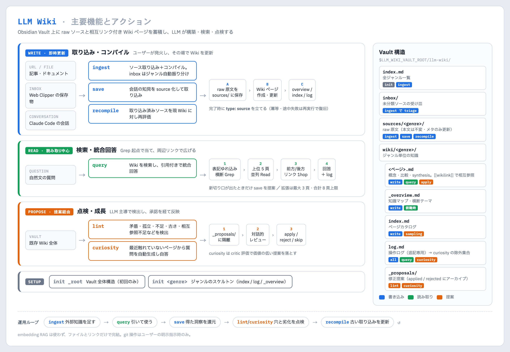

# LLM Wiki

Andrej Karpathy が提唱する「LLM Wiki」を Obsidian Vault 上に構築・維持するスキル。ソースは **raw 原文のまま保持**し（原典の immutable な raw sources レイヤーに相当）、要約・知識の構造化は Wiki ページ側が担う。両者を相互リンクで結び知識を蓄積していく。



図の元 HTML は `assets/llm-wiki-overview.html`。

## Vault パス（要設定）

このスキルは Obsidian Vault のルートパスを環境変数で受け取る。**初回利用時にユーザー環境に合わせて設定**する。

- `LLM_WIKI_VAULT_ROOT` — Obsidian Vault のルート絶対パス（例: `~/ObsidianVault`、`~/Documents/Obsidian/MyVault`、iCloud 同期 Vault など）
- `WIKI_ROOT = $LLM_WIKI_VAULT_ROOT/llm-wiki` — references 内で多用する内部短縮形

### 設定方法

恒久的な設定方法は次の 2 通り。

1. **シェル起動スクリプト**: `~/.zshrc` 等に `export LLM_WIKI_VAULT_ROOT="<path>"` を追加
2. **Claude Code の `settings.json` / `settings.local.json`**: `env` ブロックに記載

   ```json
   {
     "env": {
       "LLM_WIKI_VAULT_ROOT": "/absolute/path/to/Vault"
     }
   }
   ```

   `~/.claude/settings.json`（ユーザー全体）、プロジェクト内 `.claude/settings.json`（コミット対象）、`.claude/settings.local.json`（個人ローカル）のいずれでも可。Claude Code 起動時に自動で環境変数として注入される。

恒久的に設定していない場合は、初回操作時にスキルが `AskUserQuestion` で尋ねる（**そのセッション内のみ**保持。次セッションでも未設定なら再度尋ねる）。

## ディレクトリ構造

```
<Vault>/llm-wiki/           # = $WIKI_ROOT
├── index.md                # 全体カタログ（ジャンル一覧）
├── inbox/                  # 未分類ソースの一時置き場（Web Clipper 等の受け皿）
├── wiki/<genre>/
│   ├── index.md            # ジャンル内ページカタログ
│   ├── log.md              # ジャンル内操作ログ（追記専用）
│   ├── _overview.md        # ジャンル概要・知識マップ
│   ├── _proposals/         # curiosity/lint が生成する修正提案の隔離保存先
│   │   ├── applied/        # apply 済みアーカイブ
│   │   └── rejected/       # reject 済みアーカイブ
│   └── <ページ名>.md
└── sources/<genre>/        # ジャンル確定済みソースの raw 原文（本文は無加工、frontmatter にメタ付与）
```

`inbox/` は `sources/<genre>/` とは独立した最上位ディレクトリで、`ingest` 実行時に triage（ジャンル振り分け）の対象として別扱いされる。Web Clipper の保存先をここに向ける運用を推奨。

## 動詞ディスパッチ

ユーザー入力に応じて該当する詳細仕様を `references/` から読み込み、その手順に従う。

| 動詞 | 用途 | 詳細 |
|---|---|---|
| `init <ジャンル>` | 新ジャンルのスケルトン生成（初回は引数 `_root` で全体構造） | [references/init.md](references/init.md) |
| `ingest [パス\|URL]` | ソース取り込み + コンパイル（引数なしは未取り込み全件処理） | [references/ingest.md](references/ingest.md) |
| `save [タイトル]` | 直前会話を `source_kind: conversation` として取り込み + コンパイル | [references/save.md](references/save.md) |
| `recompile <パス>` | 取り込み済みソースの再コンパイル（メンテナンス用、引数必須） | [references/recompile.md](references/recompile.md) |
| `query <質問>` | Wiki検索・統合回答・必要なら新ページ提案 | [references/query.md](references/query.md) |
| `lint` | Vault健全性チェック + 全観点の自動修正 + 自動コミット | [references/lint.md](references/lint.md) |
| `curiosity [--budget N=5]` | Wiki全体を能動的に点検し、自動生成質問の結果を proposals として書き出し（N 省略時は 5 ページ） | [references/curiosity.md](references/curiosity.md) |

## 取り込み状態の判定

`sources/<genre>/<file>.md` の取り込み状態は **frontmatter の `type`（`source` または旧 `source-summary`）の有無** で判定する（`ingest` は未済を処理、`recompile` は済を再処理）。詳細は [references/conventions.md](references/conventions.md) の「`type: source` はコンパイル完了マーカー」セクション。

## 共通ルール

- **記述規約**（frontmatter / wikilink / 言語）: [references/conventions.md](references/conventions.md)
- **判断基準**（ページ新規/更新/分割、query結果の保存可否）: [references/decision-rules.md](references/decision-rules.md)
- **提案システム**（curiosity の修正案隔離・対話的レビュー、curiosity/lint 共通の apply セマンティクスと記録形式）: [references/proposals.md](references/proposals.md)
- 各操作の最後に必ず `wiki/<genre>/log.md` に追記し、何をしたかを残す。

## 即時更新 vs 提案経由

動詞は Wiki 本体への反映方法で 3 系統に分かれる:

- **即時更新**: `ingest` / `save` / `recompile` — ユーザーが明示的に発火させた書き込み操作。即座に Wiki を更新する
- **提案経由**: `curiosity` — LLM 主導で問いを立てて新しい知見を生成する操作。修正案を `_proposals/` に書き出し、対話的レビューを経て反映する
- **自動修正 + 自動コミット**: `lint` — Vault の健全性を全観点で点検し、原典で裏付けを取ったうえで自動修正して 1 コミットにまとめる。切り戻しは `git revert` で行う（[lint.md](references/lint.md)）
- **読み取り中心**: `query` — Wiki を読み合成回答を返す。例外的に「軽微な追記で済む」と判定した場合のみ対象ページに直接 Edit する分岐がある（[query.md](references/query.md) ステップ5）。`log.md` への追記は必ず発生し、curiosity の除外集合に貢献する

詳細は [references/proposals.md](references/proposals.md) の「他動詞との関係」を参照。

## 検索の方針

検索 (`query`) は **Grep 起点 + 周辺リンク拡張** で行う。index を上から辿らず、ページに直接当てる。

- 質問のキーワードを表記ゆれ込みの正規表現にまとめ、`wiki/*/*.md` を横断 Grep して候補ページを特定する（ファイル名一致・synthesis・ヒット数で順位付け）
- 上位ページを並列 Read し、足りなければ前方リンク（`[[wikilink]]`）と後方リンク（被リンク Grep）で 1hop だけ広げる
- `index.md` / `_overview.md` は原則読まない。俯瞰型の質問か Grep が 0 件のときだけ `_overview.md` を使う
- embedding ベース RAG は使わない（外部依存・freshness・auditability の観点から）
- 同じステップ内の Grep / Read は 1 メッセージ内で並列発行する（往復は 2〜3 回が目安）

詳細な実行手順は [references/query.md](references/query.md) を参照。

## 安全側の方針

- **自動コミットは lint のみ**: `lint` は自動修正の結果を Vault にコミットする（変更ファイルのみ個別 add、push はしない）。それ以外の動詞では、git 操作はユーザーが明示的に指示した場合のみ。
- **ソース raw 本文は変更不可**: `sources/` には取得した原文をそのまま保持する。更新してよいのは frontmatter メタのみで、本文テキストは要約・改変しない。
- **破壊的操作の前確認**: ページ削除・大規模リネームはユーザー確認を取ってから実施。
- **日付は実時刻**: frontmatter の `created`/`updated` や log エントリは Bash の `date` コマンドで取得した値を使う。
